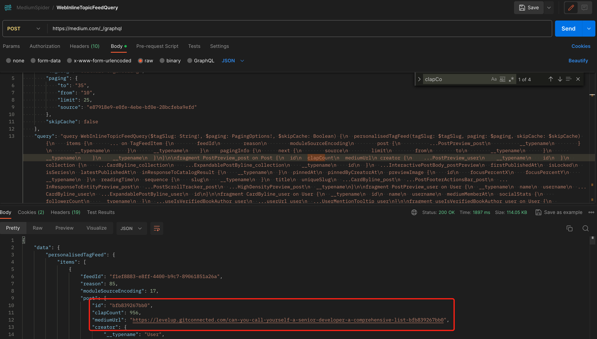

# MediumSpider

[MediumSpider] is an Python application.

It is the result of the author's participation in a coding competition. Due to limited time, the full functionality of this application has not been implemented. Let's first outline the concept as follows:

1、抓取Medium网站上，tag为software-enginnering，且claps数最高的10篇文章 【完成】

1.1 采用graphql方式获取数据,并且能够支持分页。


1.2 python使用curl模拟postman请求，得到其id,clapcount和url，最大支持25条每次。考虑到网页查询到该tag下有8.7W条数据，因此做了一个循环，从0开始，步长为25，直到88000

1.3 将获取的数据存入sortList，进行排序。将待比较的数据和sortList里最小的一条比较，如果小于直接舍弃。如果大于则将sortList最小的一条替换，再排序，并等待下一条记录。

1.4 将最后sortList结果存入本地文件。

2、访问将对应文章的链接，提取出段落内容 【*待完成*】

3、调用chatGPT，将英文内容翻译为中文 【*待完成*】

4、将中英文内容写入PDF 【*待完成*】

5、将python封装为web应用，添加开始和下载按钮 【*待完成*】

### 如何使用

- 安装对应依赖
```
pip install python
pip install json
pip install re
pip install BytesIO
```
- 执行python脚本
```
python main.py
```
- 稍后会在main.py同级生成top10.json文件


